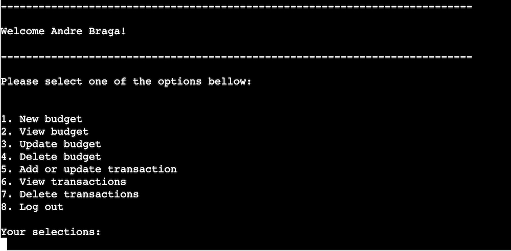
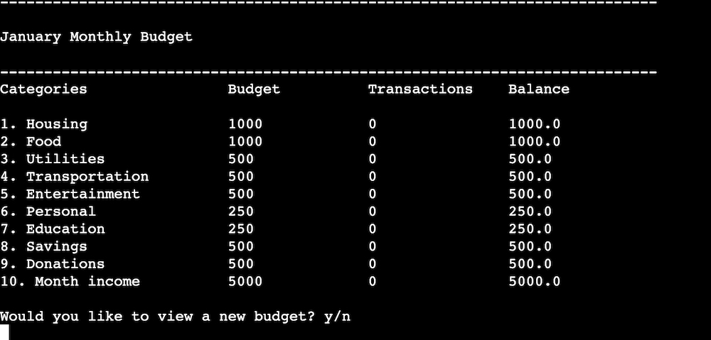
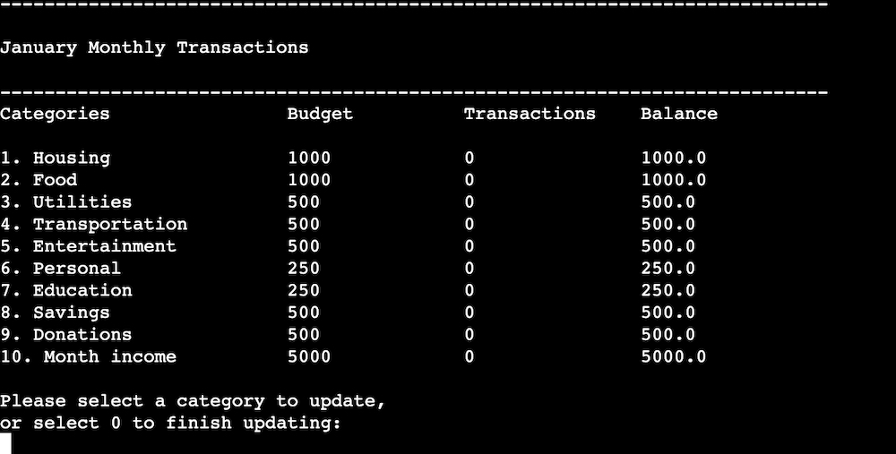
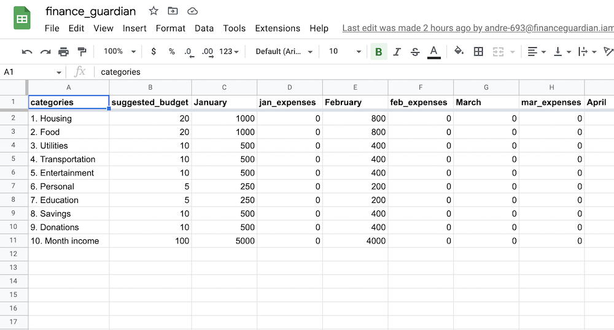
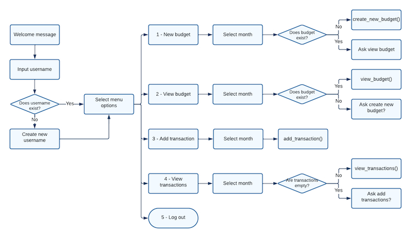
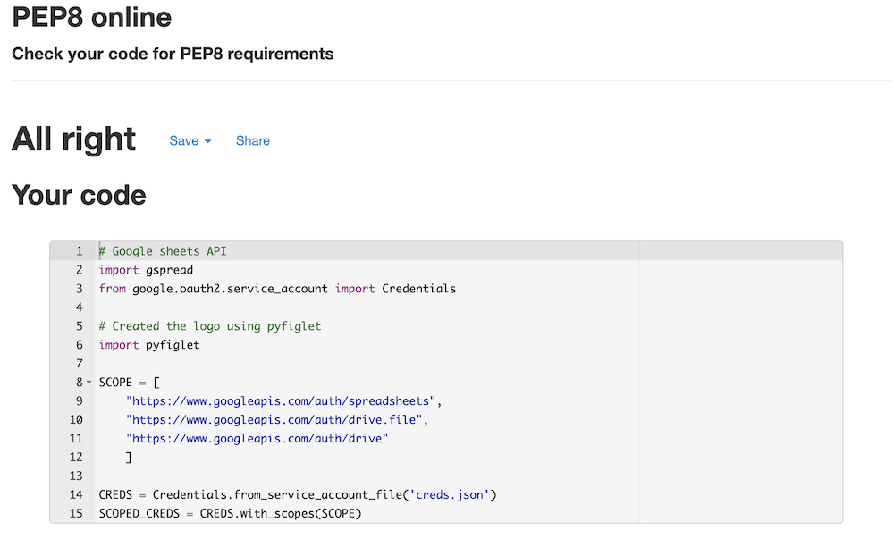
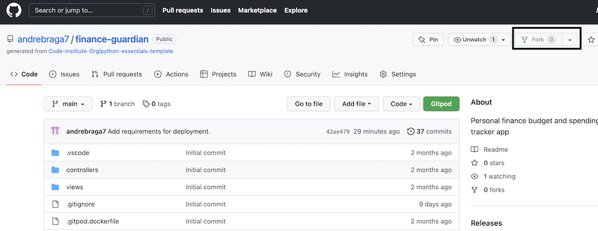

# Finance Guardian

Finance Guardian is a Python terminal personal budgeting app that runs on Heroku's mock terminal. The ideia of the app is to allow the user to input a monthly income and have a propoes budget generated for him. He can then visualize and update the budget as needed.

### Project objectives

1. Create a Python terminal app to allow the user to input an income for a certain month and have a proposed budget generated;
2. Allow the user to visualize on a monthly bases a personal finance budget and add transactions to keep up with spendings.

You can follow the project along by visisting the mock terminal [Here](https://finance-guardian.herokuapp.com/)

# Table of content

- [**Features**](#features)
    - [Welcome message](#welcome-message)
    - [Main menu](#main-menu)
    - [New budget](#new-budget)
    - [View budget](#view-budget)
    - [Update budget](#update-budget)
    - [Delete budget](#delete-budget)
    - [Add or update transactions](#add-or-update-transactions)
    - [View transactions](#view-transactions)
    - [Delete transactions](#delete-transactions)
    - [Log out](#log-out)
    - [Future features](#future-features)
- [**Data Model**](#data-model)
- [**Flow Chat**](#flow-chart)
- [**User Input Testing**](#user-input-testing)
- [**Validator Testing**](#validator-testing)
- [**Known Bugs**](#known-bugs)
    - [Resolved](#resolved)
    - [Unresolved](#unresolved)
- [**Technologies Used**](#technologies-used)
- [**Libraries Used**](#libraries-used)
- [**Deployment**]()
    - [To deploy the project](#to-deploy-the-project)
    - [To fork the repository on GitHub](#to-fork-the-repository-on-github)
    - [To create a local clone of the project](#to-create-a-local-clone-of-the-project)
- [**Credits**](#credits)
- [**Acknowledgements**](#acknowledgements)

# Features

The Finance Guardian app was developed to have a user friendly interface in the terminal and have easy navigation through all the features.

## Welcome message

As soon as the user loads the app he is greated with the logo which was created using the [pyfiglet module](https://pypi.org/project/pyfiglet/0.7/).

Bellow the welcome message, the user is asked to input the username. If the user does not have a username, it then asks if he would like one created. If the user selects yes, a new data sheet and username is created.

- After the user enters a username it then validades the inputed username to check if it's alhpanumeric only and has between 5 and 10 characters.

[Back to table of content](#table-of-content)

## Main menu

After loading the user data, the app takes the user to the main menu with eight options: 1. New budget, 2. View budget, 3. Update budget, 4. Delete budget, 5. Add or update transactions, 6. View transactions, 7. Delete transactions and 8. Log out.

- If the user selects anything else from the given options it will say "Ivalid option" and promt the user to enter a new selection.

[Back to table of content](#table-of-content)

## New budget

When the new budget option is selected, the user is promted to select a month in which to create a new budget.

- The user input is validated to check that it's one of the available options, if not, it raises an error message and promps the user to input a new option;

- After a valid option is selected, the app checks to see if a budget already exists for that month, if yes, it alerts the user and asks him to confirm if he would still like to create a new one;

- It then asks for the user to input an income for the month, which then generated a proposed budget for that month. After generating the budget, it will display it to the user and ask if he would like to save it, if no is selected it takes the user back to the main menu.

[Back to table of content](#table-of-content)

## View budget

The view budget is very similar to the new budget. It asks the user to select a month, checks to see if a budget already exists and display the budget. If a budget has not already been created if gives the user the option to create a new one.

- After the user view the budget he has the option to view a different month or be taken back to the main menu.

[Back to table of content](#table-of-content)

## Update budget

In the update budget options. The user is prompted to select a month and then the month's budget is displayed.

- The user is given the option to select which category to update. It then updates the chosen category and asks the user to select a new one or enter 0 to finish updating;

- When the user is done, it prompts him to save or not the updates.

[Back to table of content](#table-of-content)

## Delete budget

When the delete budget option is selected, it prompts the user to select the month from which to delete the budget.

- After a valid selection is made, it asks the suer to confirm the deletion of the budget before proceeding.

[Back to table of content](#table-of-content)

## Add or update transactions

When adding or updating transactions, the app gives the user to option to first select the month and then the category in which to add a value for the transaction.

- After adding a transaction amount, the user can continue adding other transactions until 0 is selected, which then prompts the user to save or not the update.

[Back to table of content](#table-of-content)

## View transactions

When viewing transactions, the app asks for a month to be selected an displays the table with categories, budget and transaction amounts for each one.

[Back to table of content](#table-of-content)

## Delete transactions

If the user selects to delete a transactions, he is prompted to first select a month and then a confirmation message follows to confirm either yes or no for the deletion.

[Back to table of content](#table-of-content)

## Log out

Finaly the log out option, generated a good bye message with the user's name and exits the app.

[Back to table of content](#table-of-content)

## Future features

The project has potention for other features as listed bellow:
- User password for extra protection;
- The option to personalize the proposed budget when creating or updating;
- Individualized monthly transactions for each category instead of bulk amounts;
- Feedback on the balance left for each category for the budgeted amount.

[Back to table of content](#table-of-content)

# Data Model

This project uses Google Sheets and Good Drive to store all the users data.
- Each user is assigned a unique user id which is then used to generate a blank sheet from a template for the user;
- In the future when using a different data storage other than Google Sheets, it would allow for more organized data storage.

[Back to table of content](#table-of-content)

# Flow Chart

Bellow you can see the flow chart that was used to first visualize the app. A couple of extra features were added during development.

[Back to table of content](#table-of-content)

# User Input Testing

Manual testing was done throught the project development. If invalid data is inputed by the user the app handles it well, giving feedback about the input error or validation error.

Bellow are a couple of examples of validation or input errors handled by the app:

- Username not found

- Invalid username

- Invalid option

- Invalid data

[Back to table of content](#table-of-content)

# Validator Testing

The code was run through the [PEP8 Online validator](http://pep8online.com/) and after a couple of blank lines and trailing spaces were removed, it passed the validator with no issues.

[Back to table of content](#table-of-content)

# Known Bugs

- ## Resolved
    - A couple of bugs were detected during development, mainly with some validation errors. There were addressed and fixed during the development phase;
    - When passing the code thorought the validator, a couple minor issues were identified like blank lines and trailing white spaces. There were easily fixed by removing them.
    - When creating a new user id, the id was beeing saved as an integer which was generating an error when trying to access the user's woksheet. This was resolves by converting the user id into a string before saving it to the data sheet.

- ## Unresolved
    - When creating a new budget and entering a month income with broken decimals, it generates a long number when displaying the budget. This need to be resolved by limiting the budget number to two decimal places only, before saving the budget;
    - Other than what is specified above, here are no known unresolved issues.

[Back to table of content](#table-of-content)

# Technologies Used

These are the technologies that were used for this project:
- [Python](https://www.python.org/)
- [Google Sheets](https://www.google.co.uk/sheets/about/)
- [Gitpod](https://gitpod.io/workspaces)
- [Github](https://github.com/)
- [Heroku](https://www.heroku.com/)
- [Lucid Chart](https://www.lucidchart.com/pages/)

[Back to table of content](#table-of-content)

# Libraries Used

These were the libraries used for this project:
- [gspread](https://docs.gspread.org/en/v3.7.0/api.html)
- [credentials](https://pypi.org/project/credentials/)
- [pyfiglet](https://pypi.org/project/pyfiglet/0.7/)

[Back to table of content](#table-of-content)

# Deployment

## To deploy the project

Python is a backend language and can't be displayed with GitHub alone. To live preview the project Heroku was used with a mock terminal by [Code Institue](https://codeinstitute.net/)

Here are the steps to deploy the projct using Heroku:
- Set up a Heroku account (if needed).
- In the top right corner of the dashboard, click "New" and choose "Create new app."
- The name of your application must be unique. Click "Create App" after selecting your region.
- Click the "Settings" tab and scroll down to "Config Vars" on your project page.
- Enter "PORT" in the KEY input field, followed by "8000" in the VALUE input field and Add the Config Vars by clicking the "Add" button.
- Add the Python and Node.js buildpacks to the buildpacks section, ensuring that the Python builds are listed above the Node.js builds.
- Go back to the tabs at the top of the page, then select the "Deploy" tab and choose Github deployment.
- Then click the "Connect" button to link your repository.
- Select either Automatic Deployment or Manual Deployment at the bottom of the page. Whenever a project is pushed to Github, Automatic Deployment will deploy it to Heroku. Wait for your project to be deployed.

[Back to table of content](#table-of-content)

## To fork the repository on GitHub
You can create a copy of the repository by forking the GitHub account. This copy can be changed and edited without affecting the original repository. Follow the steps below to fork the repository:

1. Log in to the GitHub account and locate the [repositoty](https://github.com/andrebraga7/finance-guardian);
2. On the top right hand side of the page, click the **Fork** button to create a copy of the original repository on your GitHub account.

[Back to table of content](#table-of-content)

## To create a local clone of the project
To create a clone of the project from GitHub, folow the steps below:

1. In the repository page, click on the **Code** tab;
2. On the **Clone HTTPS** section, click the copy button to copy the repository URL;

3. In your IDE of choice, open **Git Bash**;
4. Change the current working directory to the location where you want the cloned directory to be made;
5. Type **git clone** and then paste the URL copied from GitHub;
6. Press **enter** to create the local clone.

[Back to table of content](#table-of-content)

# Credits

- I created the flowchart using [Lucid Chart](https://www.lucidchart.com/pages/), which was really helpfull to visualize the project logic;
- After following along the [Code Institute's Love sandwich project](https://github.com/Code-Institute-Solutions/love-sandwiches-p5-sourcecode), I was able to use a couple of function ideais in the project to validade some user input.

# Acknowledgements

This Python project was creates as the third portfolio project for the Full Stack Software Developer course from [**Code Institute**](https://codeinstitute.net). I would like to thank the [Code Institue](https://codeinstitute.net/) for the support and tutoring throught this project.

[**Andre Braga**](https://www.linkedin.com/in/andrestrevisan/) 2022

[Back to table of content](#table-of-content)